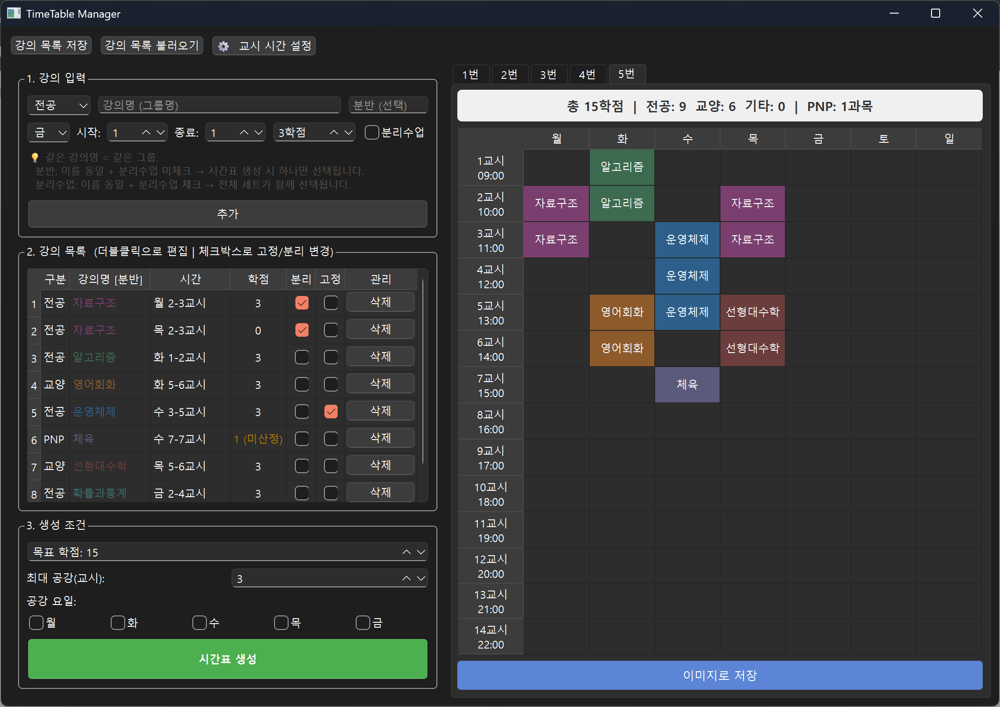

# 📅 TimeTable Manager

대학교 시간표를 자동으로 만들어주는 데스크톱 앱입니다.  
듣고 싶은 과목들을 입력하면 **조건에 맞는 시간표 조합을 자동으로 찾아줍니다.**



---

## ✨ 이런 분께 유용해요

- 수강 신청 전에 시간표 조합을 미리 확인하고 싶은 분
- 공강 요일이나 최대 공강 시간 조건을 맞추고 싶은 분
- 분반이 여러 개인 과목 중 어떤 조합이 가능한지 알고 싶은 분

---

## 🖥 설치 방법

### 1. Python 설치 확인

터미널(명령 프롬프트)에서 아래 명령어를 입력해 Python이 설치되어 있는지 확인합니다.

```bash
python --version
```

> Python 3.10 이상이 필요합니다.  
> 설치가 안 되어 있다면 [python.org](https://www.python.org/downloads/)에서 받아주세요.

### 2. 저장소 다운로드

```bash
git clone https://github.com/yourname/timetable-manager.git
cd timetable-manager
```

> Git이 없다면 GitHub 페이지에서 `Code → Download ZIP`으로 받아도 됩니다.

### 3. 가상환경 생성 및 활성화

```bash
# 가상환경 생성
python -m venv venv

# 활성화 (macOS / Linux)
source venv/bin/activate

# 활성화 (Windows)
venv\Scripts\activate
```

### 4. 필요 패키지 설치

```bash
pip install -r requirements.txt
```

### 5. 실행

```bash
python main.py
```

---

## 🚀 사용 방법

### Step 1 — 과목 입력

화면 왼쪽 **1. 강의 입력** 영역에서 과목 정보를 입력하고 **추가** 버튼을 누릅니다.

| 항목 | 설명 |
|------|------|
| 구분 | 전공 / 교양 / 기타 / PNP 중 선택 |
| 강의명 | 과목 이름. **같은 이름 = 같은 과목**으로 인식됩니다 |
| 분반 | 목록에서 구분할 때 쓰는 메모 (선택 사항) |
| 요일 / 시작·종료 교시 | 수업이 있는 시간 |
| 학점 | 이수 학점 수 |
| 분리수업 | 주 2회처럼 여러 시간대가 세트인 경우 체크 |

---

### Step 2 — 분반 vs. 분리수업 이해하기

**같은 강의명**으로 등록한 과목들은 하나의 그룹으로 묶입니다.  
이때 **분리수업 체크 여부**에 따라 동작이 달라집니다.

#### 📌 분반 (분리수업 미체크)
같은 이름으로 여러 시간대를 등록하면, 시간표 생성 시 **그 중 하나만 선택**됩니다.

```
예) 영어회화 (화 5-6교시)
    영어회화 (목 3-4교시)
→ 둘 중 하나가 자동 선택됨
```

#### 📌 분리수업 (분리수업 체크)
같은 이름으로 등록된 슬롯이 **항상 세트로 함께 선택**됩니다.

```
예) 대학수학 (월 1-2교시) ← 분리수업 체크
    대학수학 (목 1-2교시) ← 분리수업 체크
→ 두 슬롯이 반드시 함께 편성됨
```

---

### Step 3 — 고정 과목 설정

**2. 강의 목록** 표의 **고정** 체크박스를 활성화하면, 해당 과목이 모든 시간표에 반드시 포함됩니다.  
이미 수강 신청이 완료된 과목이나 꼭 들어야 하는 과목에 사용하세요.

---

### Step 4 — 생성 조건 설정

**3. 생성 조건** 영역에서 원하는 조건을 설정합니다.

| 항목 | 설명 |
|------|------|
| 목표 학점 | 완성된 시간표의 총 학점 (PNP 제외) |
| 최대 공강(교시) | 같은 날 수업 사이에 허용할 최대 빈 교시 수 |
| 공강 요일 | 아예 수업을 넣지 않을 요일 |

설정이 끝나면 **시간표 생성** 버튼을 누릅니다.

---

### Step 5 — 결과 확인 및 저장

생성된 시간표가 오른쪽 탭(1번, 2번 …)에 표시됩니다.  
마음에 드는 탭을 선택한 뒤 **이미지로 저장** 버튼을 눌러 PNG/JPG 파일로 내보낼 수 있습니다.

---

## 💾 과목 목록 저장 / 불러오기

매번 다시 입력하지 않아도 됩니다.

- **강의 목록 저장** — 현재 과목 목록을 JSON 파일로 저장
- **강의 목록 불러오기** — 저장해 둔 JSON 파일을 불러와 목록 복원

---

## ⚙ 교시 시간 설정

상단의 **교시 시간 설정** 버튼을 누르면 학교마다 다른 교시 시작 시간을 직접 입력할 수 있습니다.  
설정하면 시간표 세로 헤더에 시작 시간이 함께 표시됩니다.

---

## 📁 파일 구조

```
timetable-manager/
├── main.py          # 메인 윈도우 및 UI 전체
├── logic.py         # 시간표 생성 알고리즘
├── models.py        # 과목(Course) 데이터 모델
├── ui_widgets.py    # 시간표 표시 위젯
├── constants.py     # 요일 목록, 기본 교시 시간
├── requirements.txt
└── assets/
    └── screenshot.png
```

---

## 🛠 기술 스택

- **Python 3.10+**
- **PySide6** (Qt for Python) — GUI 프레임워크

---

## 📄 라이선스

MIT License